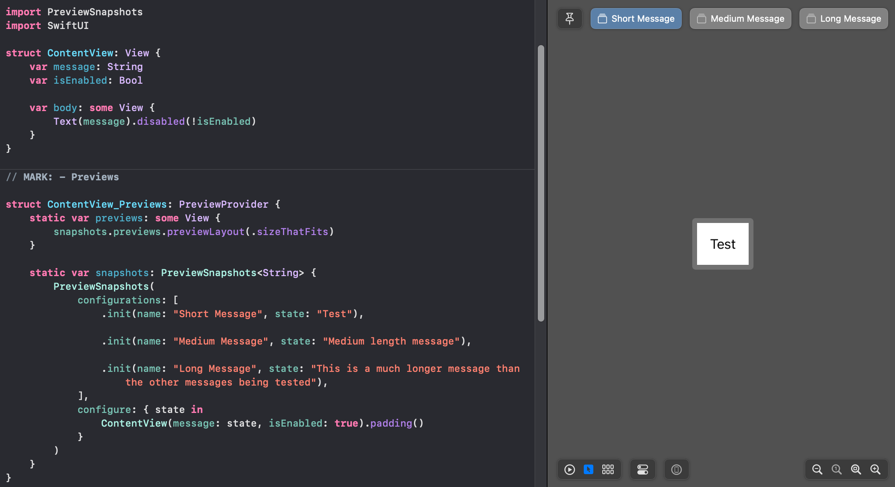
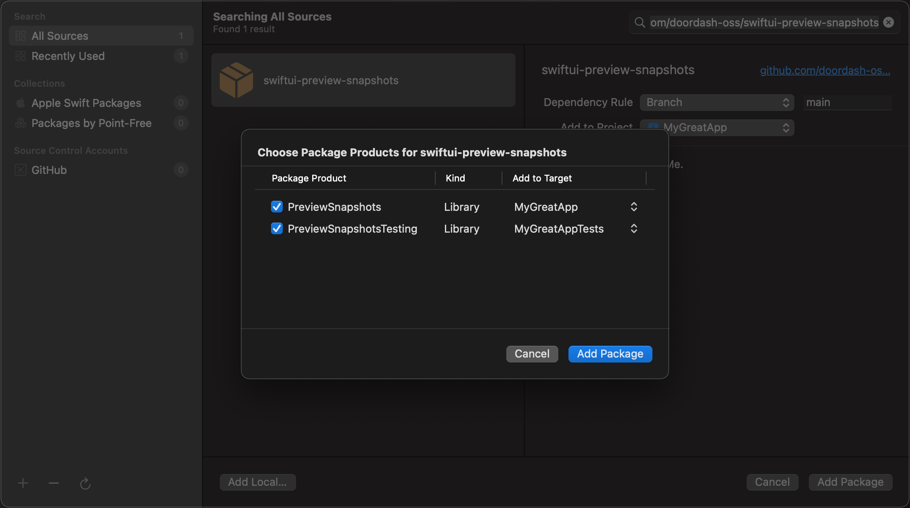

# PreviewSnapshots

Library for sharing view configurations between SwiftUI previews and [SnapshotTesting](https://github.com/pointfreeco/swift-snapshot-testing) snapshot tests.

## Usage

### In Previews

Import `PreviewSnapshots` and define a static computed `snapshots` property on the `PreviewProvider` implementation.

Provide as many configurations as you'd like within `snapshots` and then return `snapshots.previews` from the `previews` computed property.

```swift
import PreviewSnapshots
import SwiftUI

struct ContentView: View {
    var message: String
    var isEnabled: Bool

    var body: some View { ... }
}

// MARK: - Previews

struct ContentView_Previews: PreviewProvider {
    static var previews: some View {
        snapshots.previews.previewLayout(.sizeThatFits)
    }

    static var snapshots: PreviewSnapshots<String> {
        PreviewSnapshots(
            configurations: [
                .init(name: "Short Message", state: "Test"),

                .init(name: "Medium Message", state: "Medium length message"),

                .init(name: "Long Message", state: "This is a much longer message than the other messages being tested"),
            ],
            configure: { state in
                ContentView(message: state, isEnabled: true).padding()
            }
        )
    }
}
```

Xcode will create an individual SwiftUI Preview for each configuration that's provided.



### In Snapshot Tests

Import `PreviewSnapshotsTesting` and call `ContentView_Previews.snapshots.assertSnapshots()` within a test.

`PreviewSnapshotsTesting` will generate a separate snapshot for each configuration defined within `snapshots` and compare the to the reference on disk.

See the [SnapshotTesting](https://github.com/pointfreeco/swift-snapshot-testing) library for additional information on snapshot testing.

```swift
import PreviewSnapshotsTesting
import XCTest

@testable import ContentModule

final class ContentViewSnapshotTests: XCTestCase {
    func test_snapshots() {
        ContentView_Previews.snapshots.assertSnapshots()
    }

    func test_disabled_snapshots() {
        // `PreviewProvider` can define multiple `PreviewSnapshot` collections to group like tests.
        ContentView_Previews.disabledSnapshots.assertSnapshots()
    }
}
```
## Installation

### Xcode

 1. From the **File** menu select **Add Packags…**.
 2. Enter package repository URL: `https://github.com/doordash-oss/swiftui-preview-snapshots`
 3. Confirm the version and let Xcode resolve the package
 4. On the final dialog, ensure the **Add to Target** column for **PreviewSnapshots** is set to the app target and update the **Add to Target** column for **PreviewSnapshotsTesting** to the app's test target



### Swift Package Manager

1. Add the package as a dependency in `Package.swift`:

```swift
dependencies: [
    .package(url: "https://github.com/doordash-oss/swiftui-preview-snapshots", from: "1.0.0"),
]
```

2. Add `PreviewSnapshots` and `PreviewSnapshotsTesting` as a dependency of your primary and test targets respectively:

```swift
targets: [
    .target(
        name: "MyGreatApp"
        dependencies: [
            .product(name: "PreviewSnapshots", package: "swiftui-preview-snapshots"),
        ]
    ),
    .testTarget(
        name: "MyGreatAppTests",
        dependencies: [
            "MyGreatApp",
            .product(name: "PreviewSnapshotsTesting", package: "swiftui-preview-snapshots"),
        ]
    )
]
```

## Acknowledgement

`PreviewSnapshots` drew inspiration from [this talk](https://www.youtube.com/watch?v=tk0HzScvW2M) by Nataliya Patsovska Marmelstein

## License

This library is released under the Apache 2.0 license. See [LICENSE](LICENSE) for details.